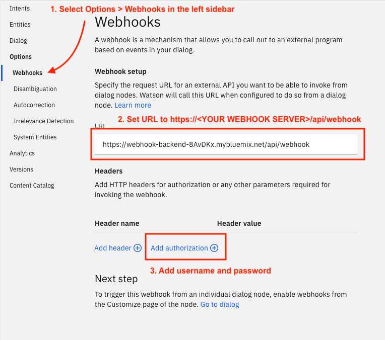
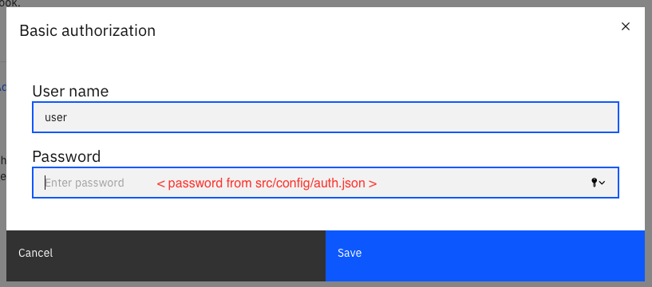
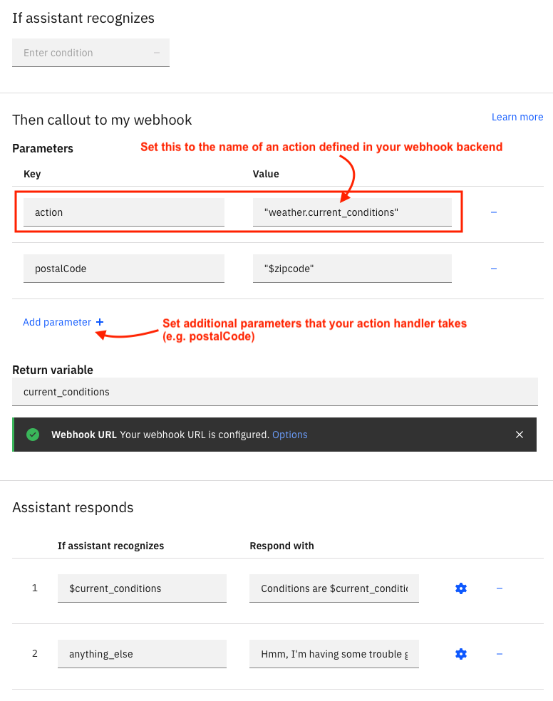

# Webhook Backend
This is a simple webhook backend pattern for webhooks in Watson Assistant. This pattern is intended for simple to moderate complexity glue-code-type use cases where the webhook is essentially proxying calls to integrate with backend systems.

## Organization
- Datasource interface code (backend systems) goes in `src/datasources`
- Route handlers for webhook actions go in `src/routes/api/webhook`

```
src
|- config
|  |- auth.json
|
|- datasources
|  |- index.js
|  |- twc.js
|
|- routes
|  |- api
|     |- webhook
|        |- index.js
|        |- weather.js
|
|- app.js
|- utils.js
```

## Deploying
1. Ensure you have the [IBM Cloud CLI](https://cloud.ibm.com/docs/cli?topic=cli-install-ibmcloud-cli#install-ibmcloud-cli) and Git installed. Alternately, you can follow the below steps in the [IBM Cloud Shell](https://cloud.ibm.com/docs/cloud-shell?topic=cloud-shell-getting-started) environment.

2. Log in to the CLI (skip if using IBM Cloud Shell)
```bash
ibmcloud login --sso
```
3. Target a Cloud Foundry organization. Skip targeting a space for now.
```bash
ibmcloud target --cf
```
4. Create a Cloud Foundry space named `wa-webhook-backend` for this project 
```bash
ibmcloud cf create-space wa-webhook-backend
```
5. Set your targeted CF space to the new space, `wa-webhook-backend`
```bash
ibmcloud target -s wa-webhook-backend
```
6. Edit `manifest.yml` file to have a custom route (see comment in that file)

7. Edit `src/config/auth.json` and insert a real password value. You will use this password in the webhook settings in Watson Assistant. On a Linux/Unix system, you can generate a strong random password with the command below:
```bash
dd if=/dev/random bs=128 count=1 | md5
```

8. Deploy the application
```bash
ibmcloud cf push
```

9. Set the `TWC_API_KEY` environment variable on your app
```bash
# syntax is: 
# ibmcloud cf set-env APP_NAME ENV_VAR_NAME ENV_VAR_VALUE
ibmcloud cf set-env webhook-backend TWC_API_KEY <YOUR TWC API KEY>
```

10. Restage the application to pick up the new environment variable
```bash
ibmcloud cf restage webhook-backend
```

## Using the Webhook From Watson Assistant

1. Set up the webhook URL


2. Add the credentials (from `src/config/auth.json`)


3. Use the webhook in node(s) in your dialog flow


Note: The webhook response will be saved to the variable you set in the **Return variable** field on the node settings. You can access nested values using a period, i.e. `$current_conditions.temperature`.